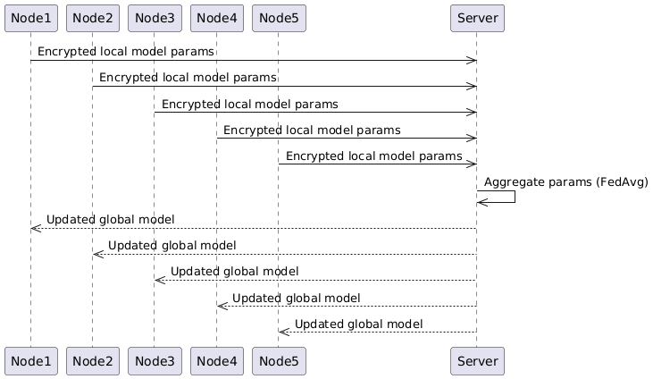

# Horizontal Federated Learning (HFL) Environment

This module simulates a **Horizontal Federated Learning** (HFL) scenario, where different nodes (e.g., hospitals) possess **similar features** but **different patient cohorts**.

## 🏥 Use Case

Hospitals share the same schema (e.g., blood pressure, vitals) but hold distinct patient records. The objective is to collaboratively impute missing values without centralizing raw patient data.

---

## 📁 Folder Structure

```
HFL_env/
├── test.py                  # Test script for the environment
├── docker-compose.yml       # Docker Compose configuration for multi-container setup
├── README.md                # Environment-specific documentation
├── notebooks/               # Jupyter notebooks and utility scripts
│   ├── explanatory_variables.ipynb  # Notebook for feature exploration
│   ├── regression.ipynb             # Regression analysis notebook
│   ├── classification.ipynb         # Classification analysis notebook
│   ├── functions.py                 # Python functions used in notebooks
│   └── __pycache__/                 # Python bytecode cache
├── data/                    # Data for each node and scripts for data processing
│   ├── node1/ ... node5/    # Data directories for each node
│   └── scripts/             # Data extraction and splitting scripts
│       ├── extract_vitalSigns_labResults.py
│       └── split_csv_files.py
├── server/                  # Central server code and results
│   ├── requirements.txt     # Python dependencies for server
│   ├── launch.sh            # Script to launch the server
│   ├── Dockerfile           # Dockerfile for server container
│   ├── .dockerignore        # Docker ignore file
│   ├── logs/                # Server log files (e.g., central_server.log)
│   ├── imputation/          # Imputation scripts and results
│       ├── machine_learning_regression.py
│       ├── deep_learning_regression.py
│       ├── deep_learning_classification.py
│       ├── machine_learning_classification.py
│       ├── functions.py
│       └── statistical.py
│   └── results/             # Output results (dl_results, ml_results, stat_results)
├── nodes/                   # Node code and results
│   ├── requirements.txt     # Python dependencies for nodes
│   ├── launch.sh            # Script to launch nodes
│   ├── Dockerfile           # Dockerfile for node containers
│   ├── .dockerignore        # Docker ignore file
│   ├── logs/                # Node log files (e.g., nodes.log)
│   ├── imputation/          # Imputation scripts and results (similar to server)
│   └── results/             # Output results (dl_classification, ml_classification, etc.)
├── certificates/            # SSL certificates for secure communication
│   ├── node1/ ... node5/    # Certificates for each node
│   └── central_server/      # Certificate for the central server
└── auth_keys/               # Authentication keys for secure access
    ├── node1/ ... node5/    # Keys for each node
    └── central_server/      # Key for the central server
```
## 🔁 HFL Workflow Overview

The following diagram illustrates the overall workflow of the Horizontal Federated Learning (HFL) environment:

