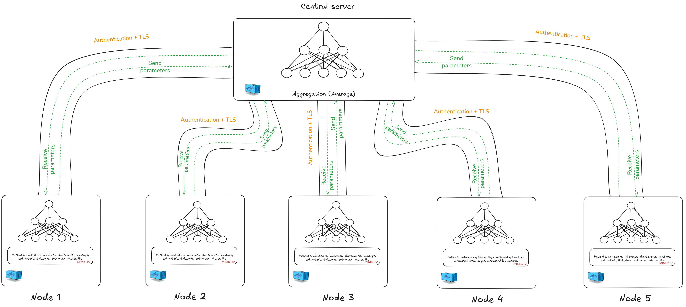
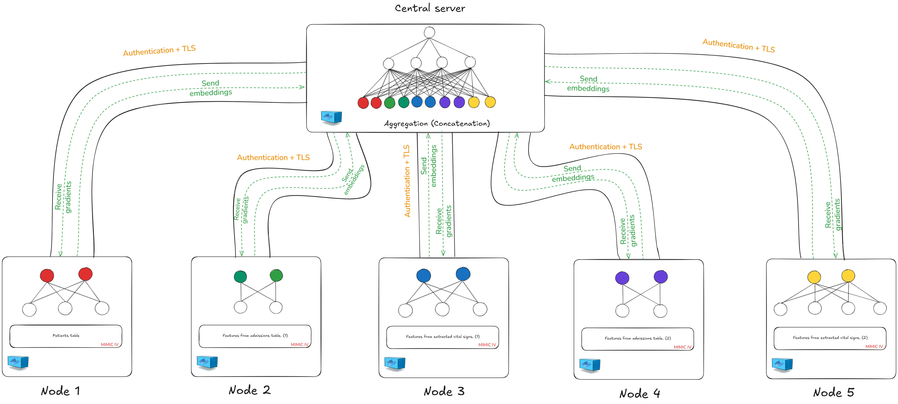
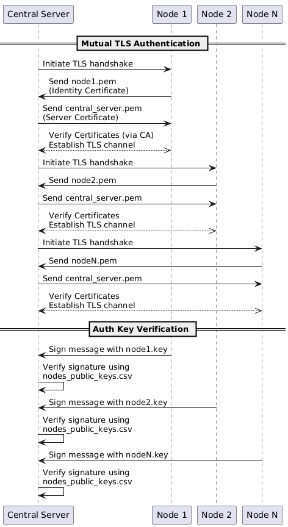
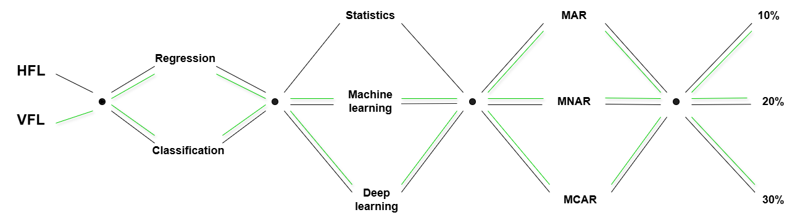

# Federated Learning Environments for Creating and Evaluating Federated Models across Multiple Tasks

This repository provides a complete and extensible framework for designing, simulating, and benchmarking **Federated Learning (FL)** models across multiple machine learning tasks — particularly focusing on **missing data imputation** in **Medical IoT** environments.

It enables the evaluation of a wide range of **imputation techniques** (Statistical, Machine Learning, and Deep Learning) under various **missingness conditions** (MCAR, MAR, MNAR), while ensuring **data privacy** through federated design (Horizontal and Vertical FL) and secure communication.

---

## 📁 Project Structure

- `HFL_env/`: Horizontal Federated Learning environment (same features, different patients)
  
- `VFL_env/`: Vertical Federated Learning environment (same patients, different features)
  

Both environments are self-contained and built using Docker, with secure, scalable, and reproducible pipelines for executing federated training rounds and collecting evaluation results.

---

## 📌 Framework Purpose

This framework is designed for:

- **Creating realistic federated learning simulations** for medical and IoT data.
- **Injecting and analyzing missing data** (MCAR, MAR, MNAR) under controlled settings.
- **Evaluating imputation models** (Statistical, ML, DL) within federated environments.
- **Supporting multiple tasks**, including:
  - Regression 
  - Classification 
The ultimate goal is to assess model performance across nodes while preserving **data locality** and ensuring **secure communication**.

---

## 🚀 Features

- ✅ Dockerized environments for both HFL and VFL setups
- ✅ Integrated support for:
  - Regression & Classification tasks
  - Imputation using:
    - **Statistical methods** (mean, median, mode)
    - **Machine learning models** (linear and logistic regression, simple & multiple)
    - **Deep learning** (fully connected neural networks)
  - Benchmarking via RMSE (for regression) and Accuracy (for classification)
- ✅ Secure, certificate-based communication (SSL/mTLS)
  
- ✅ Centralized logging and per-node results for reproducibility and comparison

---

## 🧠 Methodology Overview

1. **Data Source**: Based on [MIMIC-IV](https://physionet.org/content/mimiciv/2.2/), a real-world critical care dataset.  
   > Access requires completion of the “CITI Program” on Responsible Use of Health Data.

2. **Imputation Strategies**:
   - Statistical: Mean, Median, Mode
   - ML: Linear/Logistic Regression (simple and multiple)
   - DL: Fully Connected Neural Networks (FCNN)

3. **Missingness Simulation**:
   - Types: MCAR, MAR, MNAR
   - Levels: 10%, 20%, 30%
   - Injected before training using custom preprocessing scripts

4. **Federated Learning Paradigms**:
   - **Horizontal FL**: Each node holds data from different patients with the same features
   - **Vertical FL**: Each node holds different features for the same patients
   - Powered by [Flower](https://flower.dev/), a flexible FL framework supporting multi-node orchestration

---

## 🖼️ Architecture Overview

This high-level architecture shows the separation between:
- Local node computation and partial model updates
- Central server aggregation
- Secure communication through mutual TLS and authentication

---

## 📂 See Also

- [`HFL_env/README.md`](./HFL_env/README.md) – Detailed documentation for Horizontal FL setup
- [`VFL_env/README.md`](./VFL_env/README.md) – Detailed documentation for Vertical FL setup
