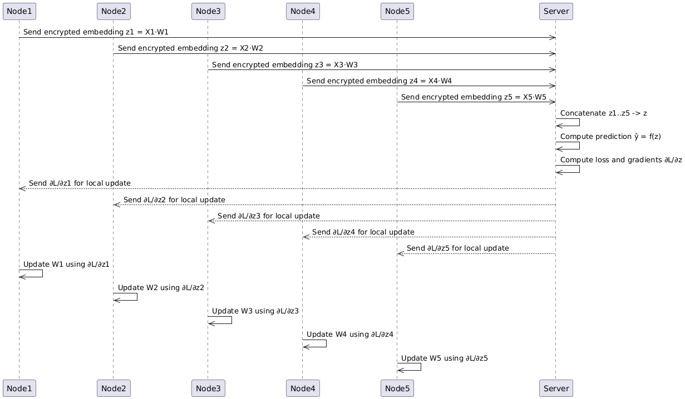

# Vertical Federated Learning (VFL) Environment

This module implements a **Vertical Federated Learning** (VFL) scenario, where each node holds **different features** for the **same set of patients**.

-> No party has access to the full patient profile.

## 📁 Folder Structure

```
VFL_env/
├── test.py                  # Test script for the environment
├── docker-compose.yml       # Docker Compose configuration for multi-container setup
├── README.md                # Environment-specific documentation
├── notebooks/               # Jupyter notebooks and utility scripts
│   ├── functions.py                 # Python functions used in notebooks
│   ├── explanatory_variables.ipynb  # Notebook for feature exploration
│   ├── regression.ipynb             # Regression analysis notebook
│   └── classification.ipynb         # Classification analysis notebook
├── data/                    # Data for each node and scripts for data processing
│   ├── node1_patients/      # Data for node 1 (patients)
│   ├── node2_admissions/    # Data for node 2 (admissions)
│   ├── node3_chartevents/   # Data for node 3 (chartevents)
│   ├── node4_labevents/     # Data for node 4 (labevents)
│   ├── node5_icustays/      # Data for node 5 (icustays)
│   └── scripts/             # Data joining and processing scripts
│       ├── file.py
│       └── join_data_script.py
├── server/                  # Central server code and results
│   ├── launch.sh            # Script to launch the server
│   ├── logs/                # Server log files
│   ├── imputation/          # Imputation scripts and results
│       ├── functions.py
│       ├── machine_learning_classification.py
│       ├── machine_learning_regession.py
│       ├── deep_learning_classification.py
│       └── deep_learning_regression.py
│   └── results/             # Output results (dl_classification, ml_classification, etc.)
├── nodes/                   # Node code and results
│   ├── launch.sh            # Script to launch nodes
│   ├── logs/                # Node log files (e.g., nodes.log)
│   ├── imputation/          # Imputation scripts and results (similar to server)
│       ├── functions.py
│       ├── machine_learning_regression.py
│       ├── machine_learning_classification.py
│       ├── deep_learning_regression.py
│       └── deep_learning_classification.py
│   └── results/             # Output results (dl_classification, ml_classification, etc.)
├── certificates/            # SSL certificates for secure communication
│   ├── node1/ ... node5/    # Certificates for each node
│   └── central_server/      # Certificate for the central server
└── auth_keys/               # Authentication keys for secure access
    ├── node1/ ... node5/    # Keys for each node
    └── central_server/      # Key for the central server
```

## 🔁 VFL Workflow Overview

The following diagram illustrates the overall workflow of the Vertical Federated Learning (VFL) environment:

